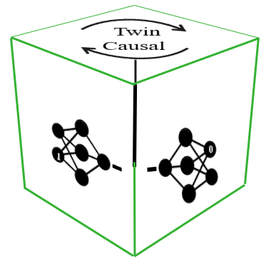

<!-- <style>
r { color: Red }
o { color: Orange }
g { color: Green }
</style>
 -->
# <g> TwinCausalNet

---------------------------------------------------

<!-- 
 -->
### Authors: Belbahri, M.<sup>* </sup>, Gandouet, O.<sup>* </sup>, Sharoff. P <sup>* </sup> 

<sup>* </sup>Equally contributing authors, alphabetical order.


**Requirements**

To setup the conda environment:
```
conda env create --file twin-causal-model.yml
conda activate twin-causal-model
```

To update installation from the file:

```
conda env update --file twin-causal-model.yml  --prune
```


**Development Instruction**

#### Install the package in editable developer mode
Use the following command provided in the snippet in the directory containing setup.py file. This avoids creating a copy in the library directory of the environment and runs locally.

```
pip install -e . 
(or) pip install --editable . 
```
Once the package is installed, it can be imported as any other package.

For example, to import train from core, use the following command for the version of the package less than 0.0.3

```
import core.train #deprecated
```
The above command are changed to

```
import twincausal #recommended
```
from version 0.0.3


To avoid the warning messages while trying to install other dependencies from pip package manager, use the following command

```
pip install --trusted-host=pypi.org --trusted-host=files.pythonhosted.org {name of package}
```

Additionally, include the flag, to tell pip to install the package inside your home directory, rather than the system python library location. In that case, also add the home directory to the sys.path for importing the package modules

```
--user
```

To install additional development dependencies, use the command

```
pip install twincausal[dev]
```

To install additional test dependencies, use the command

```
pip install twincausal[test]
```

To check the successfull instalation and other meta information, use the command

```
pip show twincausal
```


**Example Command Interface**

```
>>> import twincausal.utils.data as twindata 
>>> from twincausal.model import twin_causal

>>> X, T, Y = twindata.generator(2)  # Generate fake uplift data
>>> input_size = X.shape[1] # Number of features

>>> twin_model = twin_causal(nb_features=input_size)

>>> twin_model.fit(X, T, Y)


******************** Start epoch 1 **********************
.
.
.
>>> X_new = X
>>> pred = twin_model.predict(X_new)

```
**Test**

**1.1 Testing Requirements**

```Pytest```


**1.2 Running instructions**

Simply run command

```
pytest
``` 

in the test directory from the terminal. It automatically runs all the test modules from the test directory.

<!-- **Other information**

Here is the following, parameter information used to generate the test

*[Add table with the parameter information]*

#### NOTE: For now, the non-pruning eff. no. of neurons stats are specifically set to fake values

 -->


### Twin networks for uplift modeling: twin_causal

```
CLASS twincausal.model.twin_causal(nb_features=<required parameter>, nb_hlayers=1, nb_neurons=256, lrelu_slope=0, 
      batch_size=256, shuffle=True, max_iter=100, learningRate=0.005, reg_type=1, l_reg_constant=0.001,
      prune=True, gpl_reg_constant=0.0001, loss="uplift_loss", learningCurves=True, save_model=False, 
      verbose=False, logs=True, random_state=1234)
```
[[Source]](https://github.com/belbahrim/twin-causal-net)

This model optimizes the uplift log-loss function using stochastic (or proximal) gradient descent.


|   	        |   	|   
|:---	        |:---	|
|**Parameters**   	|  Hyper-parameters|
| |  	|
| |   **nb_features: int, (required parameter)** </br> The number of features. The number of neurons in the input layer will automatically include the treatment variable.|
| |   **nb_hlayers: int, default=1** </br> The number of hidden layers. <ul> <li>‘0’, twin network architecture with no hidden layers </li> <li>‘1’, twin network architecture with 1 hidden layer | 
| |   **nb_neurons: int, default=256** </br> The number of neurons in a hidden layer.	|
| |   **lrelu_slope: float, default=0** </br> The angle of the negative slope for the LeakyReLU activation function. Default is the ReLU activation.	|
| |   **batch_size: int, default=256** </br> Size of minibatches for stochastic optimizers.	|
| |   **shuffle: bool, default=True** </br> Whether to shuffle samples in each iteration.	|
| |   **max_iter: int, default=100** </br> Maximum number of iterations. The solver iterates until convergence (determined by ‘tol’) or this number of iterations. For stochastic solvers, note that this determines the number of epochs (how many times each data point will be used), not the number of gradient steps.	|
| |   **learningRate: float, default=0.005** </br> Learning rate schedule for weight updates. Used alongside the solver SGD and PGD	|
| |   **reg_type: int, default= 1** </br> Regularization; adds L1 or L2 regularization for optimizing the network parameters. </br>  <ul> <li>‘1’, represents L1 regularizer </li> <li>‘2’, represents L2 regularizer  	|
| |   **l_reg_constant: float, default=0.001** </br> Regularization constant which manages the weight on L1 (or L2) norm as a regularizer in the loss function for optimizing the network parameters. |
| |   **prune: bool, default=True** Pruning for regularization, reduces the effective number of nodes in the network. Depending upon the value, the following optimizer works <ul> <li>‘True (or) 1’,  PGD </li> <li>‘False (or) 0’, SGD 	|
| |   **gpl_reg_constant: float, default=0.0001** </br> Regularization constant which manages pruning the hidden-layer's nodes. |
<!-- Include the best model later -->
|   	        |   	|   
|:---	        |:---	|
|**Parameters:**   	|  Options|
| |   **learningCurves: bool, default=True** </br>  Generates a matplotlib figures for the training and validation learning curves (loss and Qini coefficient) at the end of the training.|
| |   **save_model: bool, default=False** </br>  Saves the model for inference, this will enable the flexibility for restoring the model later. The models are saved in .pth file format.|
| |   **verbose: bool, default=False** </br>  Whether to print progress messages to stdout.	|
| |   **logs: bool, default=True** </br>  Log into tensorboard for monitoring the progress of learning otherwise return a matplotlib object with training curve.	|    
| |   **random_state: int, RandomState instance, default=1234**  </br> Determines random number generation for weights and bias initialization and batch sampling in the solvers. Pass an int for reproducible results across multiple function calls.	|


## Methods

|   	        |   	|   
|:---	        |:---	|
|**fit**(X, treat, Y, val_size=0.3)   	|  Fits the model to features X, treatment variable treat and outcome variable Y. A proportion of the observations is used for validation. |
|**predict**(X)   	|  Predicts the uplift using the fitted model. |

<!--|**generator**(scenario)   	|  Generates data based on Powers et.al . | -->

```
fit(X, treat, Y, val_size=0.3) 
```
[[Source]](https://github.com/belbahrim/twin-causal-net)

Fit the model to data matrix **X**, treatment **treat** and target **Y**.


|   	        |   	|   
|:---	        |:---	|
|**Parameters:**   	|  **X** </br> Xndarray or sparse matrix of shape (n_samples, n_features) </br> The input data. | 
|   	|  **treat** </br> Xndarray or sparse matrix of shape (n_samples, 1) </br> The input treatment. | 
|   	|  **Y** </br> Xndarray or sparse matrix of shape (n_samples, 1) </br> The outcome variable. | 
|   	|  **val_size: float, default=0.3** </br> Proportion of the n_samples used for validation. | 
|**Returns:**   	|  None |  | 


```
predict(X) 
```
[[Source]](https://github.com/belbahrim/twin-causal-net)

Predicts the **uplift** associated with data matrix **X**.

|   	        |   	|   
|:---	        |:---	|
|**Parameters:**   	|  **X** </br> Xndarray or sparse matrix of shape (n_samples, n_features) </br> The input data. | 
|**Returns:**   	|  **uplift** </br> Xndarray or sparse matrix of shape (n_samples, 1) </br> The predicted uplifts. | 


### Notes

The ```twincausal``` library helps to train twin-networks for the prediction of conditional average treatment effects.
Each step of the training, it proceeds to update the model parameters in the direction of the gradients to minimize the uplift loss function.  
To avoid the over-fitting, both structured and unstructured pruning can be used to regularize the model. The model supports numpy arrays int or floats for data ingestion.   


### Reference and citing

 
If you use ```twincausal``` in a scientific publication, we would appreciate citations to the [[arXiv preprint]](https://arxiv.org/pdf/2105.05146.pdf) 
while we are developing the open source paper for the Journal of Open Source Software (JOSS). In the meantime please use the weblink to cite our software.

**A Twin Neural Model for Uplift**  </br>
Mouloud Belbahri, Olivier Gandouet, Alejandro Murua, Vahid Partovi Nia

```
@article{belbahri2021twin-causal,
  title={A Twin Neural Model for Uplift},
  author={Belbahri, Mouloud and Gandouet, Olivier and Murua, Alejandro and Partovi Nia, Vahid},
  journal={arXiv preprint arXiv:2105.05146},
  year={2021}
}
```

&copy; 2022 Twin-Causal Developers (MIT License)
